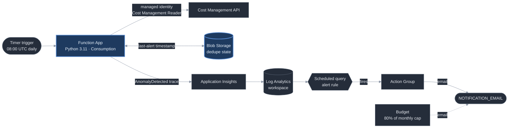

# Azure Cost Sentinel

> Watches an Azure subscription's spend and flags anomalies in plain English before they become a surprise bill.

[](https://github.com/realitylvn/azure-cost-sentinel/actions/workflows/validate.yml)


## The problem

Cloud bills creep. A VM left running after a test, a storage account with logging cranked
to debug, a retry loop hammering a paid API — none of it trips an alarm on its own, and you
find out at the end of the month when the invoice lands. Teams with a dedicated FinOps
function catch this with tooling; an individual or a small team running their own
subscription usually just... doesn't, until it hurts.

Cost Sentinel is the smallest useful version of that early-warning system: one scheduled
check that knows what "normal" looked like last week and says something the same day when
today doesn't match.

## What it does

- Runs on a timer, once a day at 08:00 UTC.
- Pulls the last 8 complete days of subscription spend from the **Cost Management API**,
  authenticating with the Function's **managed identity** (role: Cost Management Reader).
- Compares yesterday's spend against the trailing 7-day average.
- If yesterday is more than **25%** above that average (configurable), it logs a
  plain-English line: `AnomalyDetected: 41% above 7-day average`.
- An **Azure Monitor log alert** watches for that line and sends an email through an
  **Action Group**.
- A single timestamp in blob storage suppresses repeat emails for a configurable cooldown
  (default 3 days), so a week-long anomaly alerts once, not seven times.
- A **Budget** on the resource group emails independently if actual spend crosses 80% of a
  hard monthly cap — a backstop for the case where the anomaly logic itself is wrong.

## Architecture



**Services used:** Azure Functions (Python, Consumption/Y1 plan) · Bicep · Managed Identity ·
Cost Management API · Application Insights + Log Analytics · Azure Monitor scheduled-query
alert · Action Group · Consumption Budget

**Auth:** The tool's core access — the Cost Management API — is secured entirely by the
Function's system-assigned **managed identity**, scoped to **Cost Management Reader on the
resource group** (not the subscription, not a broader role). No credentials in code, and
that is the identity's **only** role assignment. Storage is reached with account-key
connection strings delivered as app settings — the Functions host's own runtime storage
(`AzureWebJobsStorage`, `azd`'s standard default) and the small dedupe-state blob
(`STATE_STORAGE_CONNECTION_STRING`, same account and key). Giving the identity storage
data-plane roles instead would widen it past the single assignment the design calls for,
to write one timestamp; see [`REVIEW.md`](REVIEW.md) for that trade-off.

## Environment

Runs against a live Azure subscription I co-administer — not a disposable sandbox. I have a
direct interest in catching cost anomalies here since it's infrastructure I'm actually
responsible for. Sample output in this README is reported as percentages, never dollar
figures, so it stays meaningful without disclosing real spend.

## What this doesn't do

- **Static threshold, not a learned baseline.** It compares against a flat 7-day trailing
  average. It doesn't model weekly seasonality (batch jobs that always run Monday) or known
  one-offs. A percentage threshold on a short trailing window is deliberately the crude
  version — it's predictable and has no training data to drift.
- **No per-resource attribution.** It tells you *that* subscription spend jumped, not
  *which* resource caused it. Grouping the Cost Management query by `ResourceId` to name the
  top mover in the alert is the obvious next iteration.
- **Quiet on near-zero subscriptions by default.** If the trailing average is under
  `MINIMUM_BASELINE_USD` (default $1/day), the percentage check is skipped entirely — a
  $0.02 → $0.09 day is "350% above average" and tells you nothing. On a subscription that
  only ever spends pennies, the tool leans on the Budget backstop instead. Lower the
  setting to opt a low-spend subscription back into percentage-based detection.
- **No operator console.** In a real deployment a dashboard for tuning thresholds and
  reviewing history would sit behind Entra ID SSO. It's omitted here so the repo stays
  publicly browsable with nothing to secure.

## Running it yourself

Prerequisites: [`azd`](https://aka.ms/azd), an Azure subscription, and permission to create
a resource-group-scoped role assignment in it.

```bash
azd env new cost-sentinel-dev
azd env set ANOMALY_THRESHOLD_PCT 25       # % over trailing average that counts as an anomaly
azd env set ALERT_COOLDOWN_DAYS 3          # suppress repeat emails for this many days
azd env set MINIMUM_BASELINE_USD 1.0       # skip the % check below this trailing daily average
azd env set BUDGET_AMOUNT_USD 5            # hard monthly cap; Budget emails at 80% of this
azd env set NOTIFICATION_EMAIL you@example.com
azd env set AZURE_LOCATION eastus2

azd up                                     # provision infra + deploy the function
```

`azd up` provisions everything in `infra/` and deploys `function/`. The timer takes over
from there; the first check runs at the next 08:00 UTC.

> **Consumption plan quota:** a brand-new subscription often starts with a **zero** quota
> for the Y1 (Consumption) App Service plan — a different quota family from VM cores. If
> `azd provision` fails preflight with `SubscriptionIsOverQuotaForSku`, request an increase
> under Portal → Quotas → **App Service**. [`REVIEW.md`](REVIEW.md) has the full story.

## Sample output

Normal day, spend in line with the trailing average (this is what the logs look like almost
every day on a healthy subscription):

```
No anomaly: 4.1% vs 25.0% threshold.
```

Near-zero subscription — the percentage check is skipped rather than firing on noise:

```
Trailing 7-day average is near zero - skipping the percentage-based check to avoid a
divide-by-zero-shaped false alarm.
```

Anomaly detected — the `WARNING`-level line the function logs, which the alert rule
matches with `traces | where message startswith "AnomalyDetected"`:

```
AnomalyDetected: 41% above 7-day average
```

That trace fires the Azure Monitor alert rule `alert-anomaly-cost-sentinel-dev`
("Azure Cost Sentinel - anomaly detected", severity 3), which routes to the Action Group
and emails `NOTIFICATION_EMAIL` using the common alert schema.

Sustained anomaly, already alerted inside the cooldown window:

```
Anomaly detected (38% above average) but suppressed - last alert was 1 day(s) ago,
within the 3-day cooldown.
```

## Cost

Built entirely on Azure's free-tier grants (Functions Consumption: 1M executions/month
free; one execution/day here). Log Analytics ingestion is capped at 1 GB/day and retention
at 30 days. Estimated cost if left running and forgotten for a year: **under $0.05/month**,
and the provisioned Budget emails at 80% of a $5 cap regardless.

## Tests

`pytest` — [`tests/test_anomaly_logic.py`](tests/test_anomaly_logic.py) covers the pure
decision function (`evaluate_anomaly`) branch by branch: anomaly, within-threshold,
below-baseline skip, cooldown suppression, cooldown expiry, insufficient data.
[`tests/test_function_indexes.py`](tests/test_function_indexes.py) asserts the worker can
import the module and register the trigger. All I/O — the Cost Management query, blob state,
logging — stays in the timer entrypoint, so the logic tests need no Azure and no clock.

```bash
pip install -r requirements-dev.txt
pytest
```

## CI

[`.github/workflows/validate.yml`](.github/workflows/validate.yml) runs on every PR and
push: it compiles the Bicep templates and runs the test suite (including the index check).
That last one matters because a plain `azd deploy` reports success even when the Python
worker fails to load and registers zero functions — a real failure mode this project hit
twice ([`REVIEW.md`](REVIEW.md)).

Deployment is done from the workstation with `azd`. Moving provision/deploy into GitHub
Actions behind an OIDC federated credential (`azd pipeline config`) is a planned follow-up —
scoped out for now to avoid standing up a deploy-capable identity trusted by a public repo.

## Built with

Designed and reviewed with Claude (architecture, spec-tightening, this README), implemented
with Claude Code and the Azure CLI in VS Code. [`REVIEW.md`](REVIEW.md) is the running build
log — every decision, every `az`/`azd` command, and the platform quirks hit along the way.

---

_Part of a portfolio of Azure / M365 automation projects._
